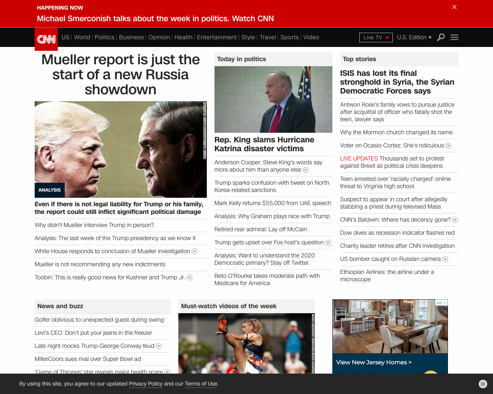

## News Homepage Archive
Welcome! This project aims to provide a visual representation of how different media organizations cover various topics. Screenshots of the homepages of five different news organizations are taken once per hour, and made public thereafter. As an example, here are the homepages of cnn.com and foxnews.com the morning after the summary of Robert Mueller's report was released:

cnn.com             |  foxnews.com
:-------------------------:|:-------------------------:
  |  


If you would like to access this archive, read on!

## How to access screenshots
The screenshots are available as `.png`s, and can be accessed directly via a URL based on the time the screenshot was taken and the website. All follow the same format of:
```
https://d1k37mkoj29puy.cloudfront.net/{website_name}/{4 digit year}/{1-2 digit month}/{1-2 digit day}/{1-2 digit hour}/2/screenshot.png
```
*Note that all dates/times are in UTC.* For example, to see what cnn.com was showing on March 24, 2019 at 3pm EDT, you would use the following URL (note the conversion of 3pm EDT to 7pm UTC):
```
https://d1k37mkoj29puy.cloudfront.net/cnn.com/2019/3/24/7/2/screenshot.png
```

The "2" is the minute that the screenshot was taken; it happens to always be "2" because the cronjob taking screenshots is set up to run on the second minute of each hour.

## How much data is there?
Screenshots are available at every hour starting from January 1, 2019. Currently, the only websites being tracked are:

1. nytimes.com
2. washingtonpost.com
3. cnn.com
4. wsj.com
5. foxnews.com

## What if I come across an error or a blank screenshot?
Some screenshots are flakey, and occasionally the screenshotting process fails. If you'd like to report those issues, please open a [Github issue](https://github.com/nrjones8/website-screenshotter/issues) - this repo will make note of specific time / website issues for any future users. There is unfortunately no way to re-capture those screenshots via this archive, but the interested reader may have luck with [The Internet Archive](https://archive.org/web/).

## Known issues, missing data
* There is unfortunately a gap in data from 2/14/2019 until 2/15/2019. A botched deploy meant the cronjob wasn't running for a day. If you are a prospective employer, please know that I monitor real production systems more carefully!
* Before April 30, 2019, all screenshots were made up only of one-screen's worth of screenshot. That is, they were not scrollable - any content below the "fold" of the front page was not captured. After April 30, full-sized, scrollable screenshots are available. See the "full_page" argument in Urlbox's [documentation](https://urlbox.io/docs) for more detail.

## Where is this data being used?
There are many different ways you could use this archive! If you do use it, please let me know so I can mention your project here. So far, the archive has been used by:

* [Storybench](http://www.storybench.org/fox-news-obsession-with-aoc-crowded-out-2020-candidate-announcements/), to highlight Fox News's constant coverage of AOC.
* [The News Homepage Archive](https://nrjones8.github.io/news-archive-explorer/#/), which displays the screenshots by site and date in a browsable interface.

## Future work, improvements
The biggest shortcoming of this archive is an inability to search the actual text of headlines - there are only images. While it's possible to OCR on existing images and get _some_ text data, the real, better solution would be to capture the structured data on a homepage using something [like Selenium](https://www.seleniumhq.org/) rather than just taking a screenshot.

## Technical Details
Screenshots are captured using [Urlbox](https://urlbox.io/), and then uploaded to S3 afterwards. They are named according to the website and time they were taken, and served behind [Cloudfront](https://aws.amazon.com/cloudfront/).

The screenshotter runs once an hour (currently on second minute of each hour), via a cronjob on an EC2 instance.
